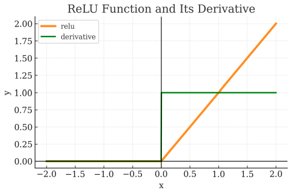
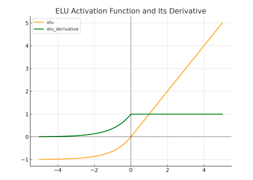

Dưới đây là phiên bản của tài liệu đã được thêm emoji để tăng phần sinh động và dễ hiểu hơn:

---

# ⚡ Activation Functions

## 🧮 Hàm Sigmoid

### 📘 Khái niệm

Hàm Sigmoid, còn được gọi là hàm logistic, là một trong những hàm kích hoạt cơ bản nhất trong học máy và mạng nơ-ron. Nó biến đổi bất kỳ giá trị đầu vào nào thành giá trị đầu ra nằm trong khoảng \$(0,1)\$.

Hàm Sigmoid:

$\text{sigmoid}(x) = \frac{1}{1+e^{-x}}$


### 🛠️ Ứng dụng

* ✅ Phân loại nhị phân

### 👍 Ưu điểm

* 🧠 **Dễ hiểu và dễ triển khai**: do tính đơn giản và phổ biến, hàm sigmoid được cài đặt trong nhiều loại mạng nơ-ron.
* 🎯 **Phạm vi đầu ra trong $\[0,1]\$**: dễ dàng diễn giải như xác suất.

### 👎 Nhược điểm

* ⚠️ **Vấn đề gradient biến mất**: khi giá trị đầu vào quá nhỏ hoặc quá lớn, đạo hàm của sigmoid tiến đến 0 → làm chậm quá trình học của mạng.
* 🔄 **Không đối xứng quanh 0**: gây khó khăn trong điều chỉnh trọng số khi huấn luyện.

### 💻 Code

**🧾 Code cài đặt sigmoid function:**

```python
import math

def calc_sig(x):
    """
    Tính hàm sigmoid: σ(x) = 1 / (1 + e^(-x))
    """
    return 1./(1+math.e**(-x))

assert round(calc_sig(3), 2)==0.95

print(calc_sig(1))
```

**📤 Kết quả:**

```
0.7310585786300049
```

---

## 🔺 Hàm ReLU

### 📘 Khái niệm

ReLU, viết tắt của “Rectified Linear Unit”, là một hàm kích hoạt rất phổ biến trong mạng nơ-ron. Đơn giản nhưng hiệu quả, ReLU không gặp phải vấn đề gradient biến mất như sigmoid.

Hàm ReLU:

$$
\mathrm{relu}(x) = 
\begin{cases}
0 & \text{nếu } x \leq 0, \\
x & \text{nếu } x \gt 0.
\end{cases}
$$



### 🛠️ Ứng dụng

* 🖼️ Nhận dạng ảnh, 🧾 xử lý ngôn ngữ tự nhiên: cải thiện tốc độ học
* 🕹️ Học tăng cường, bài toán phân loại

### 👍 Ưu điểm

* ⚡ **Tính toán đơn giản**: nhanh và hiệu quả
* 💪 **Giảm gradient biến mất**: giúp mạng học tốt hơn

### 👎 Nhược điểm

* 💀 **Vấn đề ReLU chết**: nơ-ron ngừng hoạt động nếu luôn cho đầu ra 0
* 🔄 **Không đối xứng quanh 0**: ảnh hưởng quá trình tối ưu hóa

### 💻 Code

**🧾 Code cài đặt ReLU function:**

```python
def calc_relu(x):
    """
    Tính hàm ReLU:
    ReLU(x) = max(0, x)
    """
    if x<=0:
        result = 0.0
    else:
        result = x
    return float(result)

print(calc_relu(5))
```

**📤 Kết quả:**

```
5.0
```

---

## 📉 Hàm ELU

### 📘 Khái niệm

ELU, viết tắt của *Exponential Linear Unit*, là một hàm kích hoạt hiện đại hơn, giúp khắc phục điểm yếu của ReLU và sigmoid – đặc biệt là với giá trị đầu vào âm.

$$
\mathrm{ELU}(x) =
\begin{cases}
\alpha\bigl(e^x - 1\bigr) & \text{nếu } x \leq 0,\\
x & \text{nếu } x \gt 0.
\end{cases}
$$



### 🛠️ Ứng dụng

* 🧠 **Mạng nơ-ron sâu**: giảm gradient biến mất
* 🏗️ **Mô hình học sâu phức tạp**: CNN, RNN → tăng hiệu năng

### 👍 Ưu điểm

* 🚀 **Hiệu năng cao**: vượt trội trong kiến trúc sâu
* 🔄 **Cho ra giá trị âm**: giúp cân bằng đầu ra tốt hơn

### 👎 Nhược điểm

* 🧮 **Tính toán phức tạp hơn**: tốn tài nguyên hơn so với ReLU
* 🧪 **Lựa chọn hệ số \$\alpha\$**: cần thử nghiệm để tìm giá trị tối ưu

### 💻 Code

**🧾 Code cài đặt ELU function:**

```python
import math

def calc_elu(x):
    """
    Tính hàm ELU (Exponential Linear Unit):
    ELU(x) = x                 nếu x >= 0
           = alpha * (e^x - 1) nếu x < 0
    """
    alpha = 0.01
    result = None
    if x < 0:
        result = alpha*(math.e**x - 1)
    else:
        result = x
    return result
assert round(calc_elu(1))==1

print(calc_elu(-4))
```

**📤 Kết quả:**

```
-0.009816843611112657
```

---
