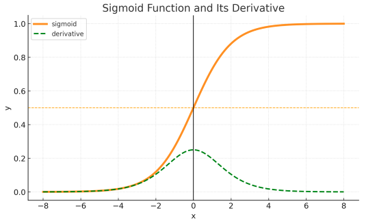

# Activation Functions

## Hàm Sigmoid

### Khái niệm

Hàm Sigmoid, còn được gọi là hàm logistic, là một trong những hàm kích hoạt cơ bản nhất trong học máy và mạng nơ-ron. Nó biến đổi bất kỳ giá trị đầu vào nào thành giá trị đầu ra nằm trong khoảng \$(0,1)\$.

Hàm Sigmoid:

$$\text{sigmoid}(x) = \frac{1}{1+e^{-x}}$$



### Ứng dụng

* Phân loại nhị phân

### Ưu điểm

* **Dễ hiểu và dễ triển khai**: do tính đơn giản và phổ biến, hàm sigmoid được cài đặt trong nhiều loại mạng nơ-ron.
* **Phạm vi đầu ra trong $\[0,1]\$**: dễ dàng diễn giải như xác suất.

### Nhược điểm

* **Vấn đề gradient biến mất**: khi giá trị đầu vào quá nhỏ hoặc quá lớn, đạo hàm của sigmoid tiến đến 0, dẫn đến vấn đề gradient biến mất và làm chậm quá trình học của mạng.
* **Không đối xứng quanh 0**: hàm không có tính đối xứng quanh 0, điều này có thể gây khó khăn trong quá trình điều chỉnh trọng số khi huấn luyện.

### Code

**Code cài đặt sigmoid function:**

```python
import math

def calc_sig(x):
    """
    Tính hàm sigmoid: σ(x) = 1 / (1 + e^(-x))
    """
    return 1./(1+math.e**(-x))

assert round(calc_sig(3), 2)==0.95

print(calc_sig(1))
```

**Kết quả:**

```
0.7310585786300049
```

## Hàm ReLU

### Khái niệm

ReLU, viết tắt của “Rectified Linear Unit”, là một hàm kích hoạt rất phổ biến trong mạng nơ-ron. Nó được đánh giá cao bởi tính đơn giản nhưng rất hiệu quả. ReLU được sử dụng rộng rãi vì nó cung cấp các đặc trưng hữu ích mà không gặp phải vấn đề gradient biến mất.

Hàm ReLU:

$$
\mathrm{relu}(x) = 
\begin{cases}
0 & \text{nếu } x \leq 0, \\
x & \text{nếu } x \gt 0.
\end{cases}
$$


### Ứng dụng

* Nhận dạng ảnh và xử lý ngôn ngữ tự nhiên: cải thiện tốc độ học, giảm vấn đề gradient biến mất
* Học tăng cường (Reinforcement Learning), các bài toán phân loại, xử lý thông tin phi tuyến

### Ưu điểm

* **Tính toán đơn giản**: nhanh và hiệu quả so với các hàm kích hoạt phi tuyến khác
* **Giảm gradient biến mất**: là yếu tố then chốt trong quá trình huấn luyện mạng nơ-ron

### Nhược điểm

* **Vấn đề ReLU chết**: đôi khi các nơ-ron luôn cho kết quả bằng 0 với mọi đầu vào và ngừng học, dẫn đến hiện tượng “ReLU chết” khi nơ-ron trở nên không hoạt động
* **Không đối xứng quanh 0**: gây khó khăn trong quá trình tối ưu hóa mạng nơ-ron

### Code

**Code cài đặt ReLU function:**

```python
def calc_relu(x):
    """
    Tính hàm ReLU:
    ReLU(x) = max(0, x)
    """
    if x<=0:
        result = 0.0
    else:
        result = x
    return float(result)

print(calc_relu(5))
```

**Kết quả:**

```
5.0
```

## Hàm ELU

### Khái niệm

ELU, viết tắt của Exponential Linear Unit, là một loại hàm kích hoạt được sử dụng trong mạng nơ-ron. ELU khắc phục một số nhược điểm của các hàm kích hoạt trước đó như ReLU. Nó giảm vấn đề gradient biến mất với các giá trị đầu vào âm, đồng thời vẫn giữ được tính phi tuyến cần thiết cho học sâu.

$$
\mathrm{ELU}(x) =
\begin{cases}
\alpha\bigl(e^x - 1\bigr) & \text{nếu } x \leq 0,\\
x & \text{nếu } x \gt 0.
\end{cases}
$$


### Ứng dụng

* **Mạng nơ-ron sâu**: nơi việc giải quyết vấn đề gradient biến mất là rất quan trọng
* **Mô hình học sâu phức tạp**: mạng tích chập (CNN) và mạng hồi tiếp (RNN) → cải thiện tốc độ huấn luyện và hiệu năng tổng thể

### Ưu điểm

* **Hiệu năng cao**: trong một số trường hợp, ELU thể hiện hiệu quả vượt trội hơn các hàm kích hoạt như ReLU và Leaky ReLU, đặc biệt với kiến trúc sâu
* **Cho ra giá trị âm**: việc có đầu ra âm giúp duy trì phân phối đầu ra cân bằng hơn, từ đó nâng cao khả năng học của mô hình

### Nhược điểm

* **Tính toán phức tạp hơn**: công thức cầu kỳ, tốn kém chi phí tính toán hơn so với ReLU
* **Lựa chọn hệ số \$\alpha\$**: giá trị \$\alpha\$ phù hợp có thể ảnh hưởng lớn đến hiệu năng mô hình, nhưng không có quy tắc chung – cần thử nghiệm để tìm giá trị tối ưu

### Code

**Code cài đặt ELU function:**

```python
import math

def calc_elu(x):
    """
    Tính hàm ELU (Exponential Linear Unit):
    ELU(x) = x                 nếu x >= 0
           = alpha * (e^x - 1) nếu x < 0
    """
    alpha = 0.01
    result = None
    if x < 0:
        result = alpha*(math.e**x - 1)
    else:
        result = x
    return result
assert round(calc_elu(1))==1

print(calc_elu(-4))
```

**Kết quả:**

```
-0.009816843611112657
```
