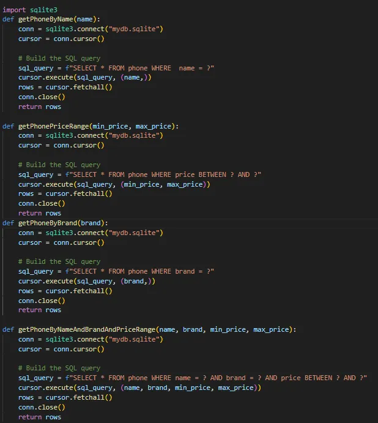
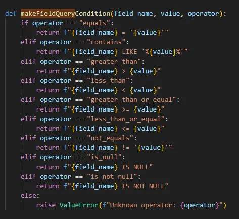
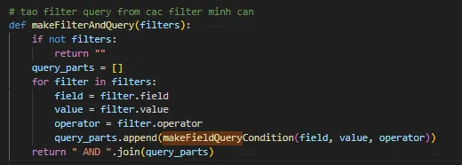
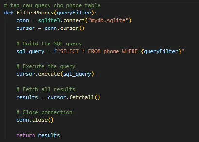
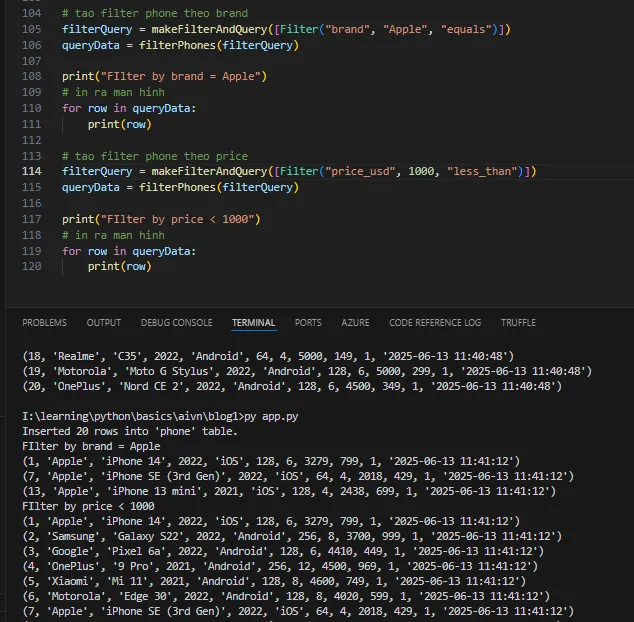
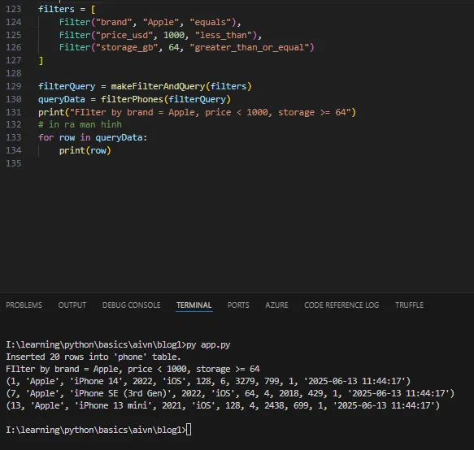

# Python basic xây dựng câu lệnh query tái sử dụng

Trong bài viết này mình sẽ hướng dẫn các bạn tạo câu lệnh query tái sử dụng nhiều lần.

Trong hình dưới đây, các bạn thấy phần bộ lọc bên tay trái có rất nhiều loại lọc để cho người dùng dễ dàng tìm kiếm kết quả mình mong muốn. Người dùng chọn loại lọc mong muốn và phía dev sẽ cần phải xử lý các dữ liệu đó và trả về kết quả cho người dùng.


Dưới đây là minh họa cho việc sử dụng, chúng ta sẽ có rất nhiều hàm khác nhau cho từng loại, nếu bạn như sẽ thấy các dòng code mở và đóng kết nối trùng lặp rất nhiều gây ra dư thừa code. Thay vào đó tại sao ta không xây dựng 1 hàm tái sử dụng nhỉ?



Đầu tiên mình tạo 1 class Filter, class này sẽ giúp chúng ta quản lí tham số lọc dễ dàng và đọc hiểu nhanh.


Tiếp theo mình sẽ tạo ra 3 hàm **filterPhones**, **makeFilterAndQuery, makeFieldQueryCondition.**

Ở hàm **makeFieldQueryCondition,** hàm này sẽ tạo ra các câu query điều kiện dựa vào các tham số chúng ta truyền vào and return lại.



Tiếp theo là hàm **makeFilterAndQuery,** ở đây ta sẽ nhận vào 1 list các loại data lọc cần thiết và sử dụng for để build từng loại lọc từ tham số filters .



Cuối cùng là hàm filter, hàm này sẽ nhận vào tham số queryFilter và mở connect tới database để query data.



**Test kết quả:**

Mình sẽ build 1 số câu query như sau:

1 câu query tìm điện thoại có brand = Apple

1 câu query tìm điện thoại có giá < 1000$



Test query với nhiều điệu kiện khác nhau:



Như các bạn thấy, code đã ngắn gọn đi rất nhiều rồi đúng không. Chúng ta giờ có thể đóng gọi lại và sử dụng cho việc sau này rồi ~~

**Code:**

```python
import sqlite3
import pandas as pd

conn = sqlite3.connect("mydb.sqlite")
cursor = conn.cursor()
# drop table if exists
cursor.execute("DROP TABLE IF EXISTS phone;")
# Create table with specified columns
cursor.execute(
    """
CREATE TABLE phone (
    id INTEGER PRIMARY KEY AUTOINCREMENT,
    brand TEXT NOT NULL,
    model TEXT NOT NULL,
    release_year INTEGER,
    os TEXT,
    storage_gb INTEGER,
    ram_gb INTEGER,
    battery_mah INTEGER,
    price_usd DECIMAL(10, 2),
    in_stock BOOLEAN DEFAULT 1,
    created_at TIMESTAMP DEFAULT CURRENT_TIMESTAMP
);
"""
)

# Read first 20 rows from CSV
df = pd.read_csv("dummy.csv").head(20)
# Insert data into table
df.to_sql("phone", conn, if_exists="append", index=False)
# Confirm insert
print("Inserted", len(df), "rows into 'phone' table.")
# Close connection
conn.close()

def makeFieldQueryCondition(field_name, value, operator):
    if operator == "equals":
        return f"{field_name} = '{value}'"
    elif operator == "contains":
        return f"{field_name} LIKE '%{value}%'"
    elif operator == "greater_than":
        return f"{field_name} > {value}"
    elif operator == "less_than":
        return f"{field_name} < {value}"
    elif operator == "greater_than_or_equal":
        return f"{field_name} >= {value}"
    elif operator == "less_than_or_equal":
        return f"{field_name} <= {value}"
    elif operator == "not_equals":
        return f"{field_name} != '{value}'"
    elif operator == "is_null":
        return f"{field_name} IS NULL"
    elif operator == "is_not_null":
        return f"{field_name} IS NOT NULL"
    else:
        raise ValueError(f"Unknown operator: {operator}")

# tao class cho tai su dung trong filter
class Filter:
    def __init__(self, field, value, operator):
        self.field = field
        self.value = value
        self.operator = operator

    def to_dict(self):
        return {"field": self.field, "value": self.value, "operator": self.operator}

# tao filter query from cac filter minh can
def makeFilterAndQuery(filters):
    if not filters:
        return ""
    query_parts = []
    for filter in filters:
        field = filter.field
        value = filter.value
        operator = filter.operator
        query_parts.append(makeFieldQueryCondition(field, value, operator))
    return " AND ".join(query_parts)

# tao cau query cho phone table
def filterPhones(queryFilter):
    conn = sqlite3.connect("mydb.sqlite")
    cursor = conn.cursor()
    
    # Build the SQL query
    sql_query = f"SELECT * FROM phone WHERE {queryFilter}"
    
    # Execute the query
    cursor.execute(sql_query)
    
    # Fetch all results
    results = cursor.fetchall()
    
    # Close connection
    conn.close()
    
    return results

# tao filter phone theo brand
filterQuery = makeFilterAndQuery([Filter("brand", "Apple", "equals")])
queryData = filterPhones(filterQuery)

# print("FIlter by brand = Apple")
# # in ra man hinh
# for row in queryData:
#     print(row)

# # tao filter phone theo price
# filterQuery = makeFilterAndQuery([Filter("price_usd", 1000, "less_than")])
# queryData = filterPhones(filterQuery)   

# print("FIlter by price < 1000")
# # in ra man hinh
# for row in queryData:
#     print(row)
    
    
filters = [
    Filter("brand", "Apple", "equals"),
    Filter("price_usd", 1000, "less_than"),
    Filter("storage_gb", 64, "greater_than_or_equal")
]

filterQuery = makeFilterAndQuery(filters)
queryData = filterPhones(filterQuery)
print("FIlter by brand = Apple, price < 1000, storage >= 64")
# in ra man hinh
for row in queryData:
    print(row)

```

**Dummy Data:**

```
brand,model,release_year,os,storage_gb,ram_gb,battery_mah,price_usd,in_stock
Apple,iPhone 14,2022,iOS,128,6,3279,799,1
Samsung,Galaxy S22,2022,Android,256,8,3700,999,1
Google,Pixel 6a,2022,Android,128,6,4410,449,1
OnePlus,9 Pro,2021,Android,256,12,4500,969,1
Xiaomi,Mi 11,2021,Android,128,8,4600,749,1
Motorola,Edge 30,2022,Android,128,8,4020,599,1
Apple,iPhone SE (3rd Gen),2022,iOS,64,4,2018,429,1
Samsung,Galaxy A53,2022,Android,128,6,5000,449,1
Realme,GT Neo 3,2022,Android,256,12,5000,599,1
Sony,Xperia 1 IV,2022,Android,256,12,5000,1399,0
Nokia,G21,2022,Android,64,4,5050,199,1
Google,Pixel 7,2022,Android,128,8,4355,599,1
Apple,iPhone 13 mini,2021,iOS,128,4,2438,699,1
Samsung,Galaxy Z Fold3,2021,Android,256,12,4400,1799,0
Huawei,P50 Pro,2021,Android,256,8,4360,999,0
Asus,ROG Phone 6,2022,Android,512,16,6000,1099,1
Xiaomi,Redmi Note 11,2022,Android,128,4,5000,229,1
Realme,C35,2022,Android,64,4,5000,149,1
Motorola,Moto G Stylus,2022,Android,128,6,5000,299,1
OnePlus,Nord CE 2,2022,Android,128,6,4500,349,1
```


