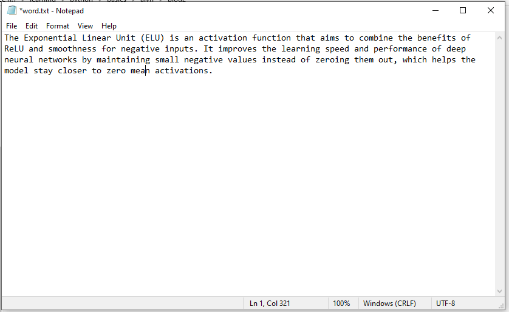

# Thực hành đếm số lần xuất hiện các từ có trong file

Hôm nay mình sẽ hướng dẫn các bạn đếm số lần các từ xuất hiện trong 1 file. Nội dung này chúng ta sẽ ôn tập lại cách sử dụng list, loop và dictionary.

Giả sử ta có 1 file word.txt như dưới đây và muốn biết xem các từ trong file này xuất hiện bao nhiêu lần. Mình sẽ dùng python để để file và sử dụng các hàm trong string cũng như list để tính toán việc này.



Lưu ý các từ sẽ nối nhau bằng khoảng trắng, 1 số từ sẽ có ngoặc hoặc dấu ., trước hoặc sau, do đó ta cần xử lý nội dung trước khi bắt đầu đếm bằng hàm sau:


Sau đó mình sẽ đọc file và tiến hành đếm các từ có trong file. Bằng cách sử dụng for và dictionary:


Cuối cùng mình sẽ in ra số lần xuất hiện của các từ bằng cách sử dụng for để in ra:


Kết quả khi chạy như sau:


Dưới đây là toàn bộ code của bài viết:

```
import re

def removeUnnessaryChar(text):
  text = re.sub(r'[(),.?!~]', '', text)
  return text

wordCount = {}
with open('word.txt', 'r') as f: # đọc file 
  contents = f.readlines() # đọc toàn bộ nội dung và chuyển sang list, biến contents sẽ chứa các dòng nội dung của file 
  for line in contents: # loop từng dòng
    line = removeUnnessaryChar(line) # loại bỏ các dấu (),. ra khỏi dòng
    words = line.split(" ") # tách các chữ ra thành list ngăn cách bởi khoảng trống
    for word in words: # loop các từ
      word = word.lower() # biến các từ thành chữ thường
      if word in wordCount: # từ đã có trong từ điền wordCount
        wordCount[word] += 1 # tăng số lần lên 1
      else: # từ không xuất hiện trong wordCount
        wordCount[word] = 1 # gán từ với số đếm là 1
        
# in ra so lan xuat hien cua cac tu
for word in wordCount.keys():
  print(word, wordCount[word])
```

Cảm ơn các bạn đã đọc bài viết~